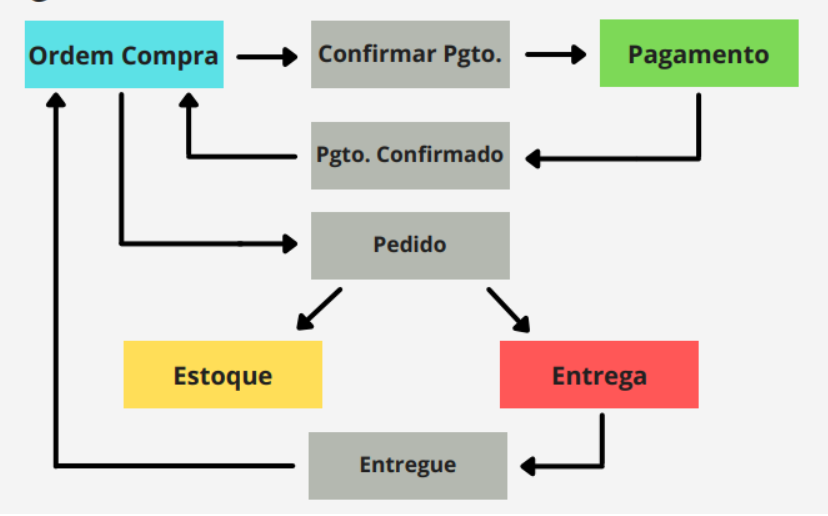
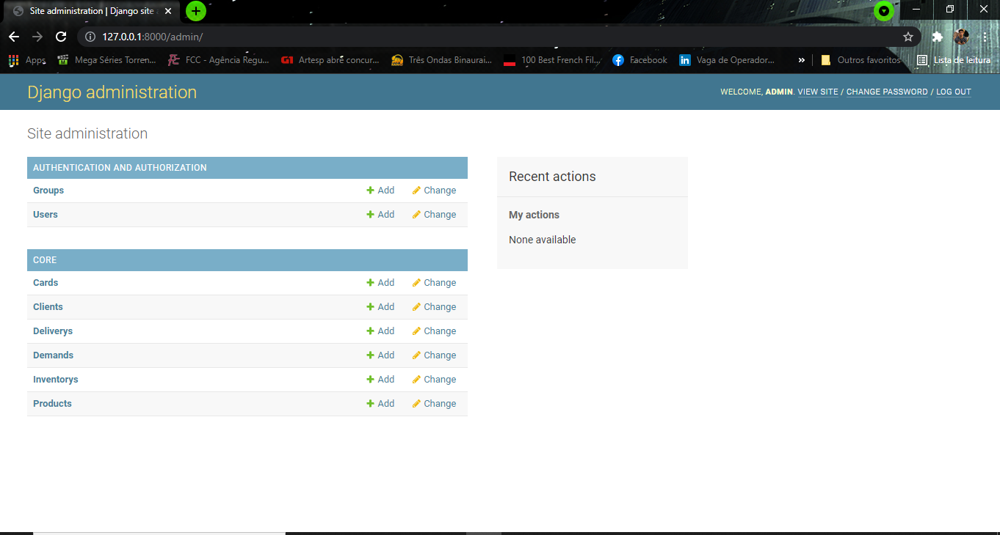
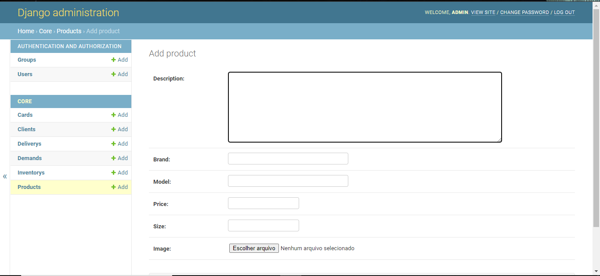
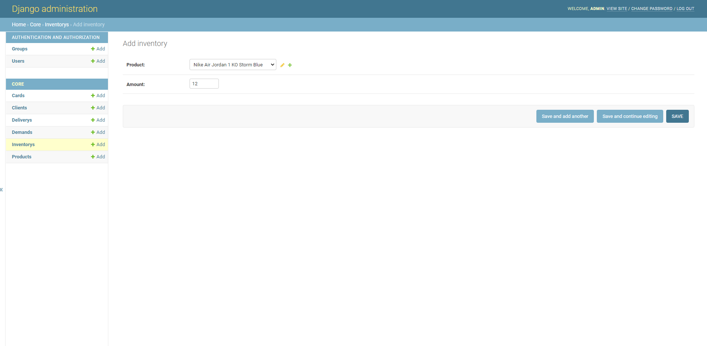

# Programa de Estágio Darede 2021 - Projeto Técnico (desafio 01)

## Sneakerhead (E-commerce)

Este repositório contém um aplicação que foi desenvolvida exclusivamente para fins didáticos, o objetivo final fazer com que o sistema de compra do e-commerce seja completo e que sirva de exemplo de como aplicar a arquitetura Event-driven.

### Visão Geral da Arquitetura



### Guia de Deploy - <b>Local</b>

#### Requisitos

Para este passo a passo você precisará dos seguintes requisitos:

* [Python 3](https://realpython.com/installing-python/)
* [PIP](https://pip.pypa.io/en/stable/installing/)
* [Django](https://docs.djangoproject.com/en/3.2/topics/install/)
* [MySQL](https://dev.mysql.com/doc/mysql-installation-excerpt/5.7/en/)

### Passo 1: Criar base de dados e usuários de acesso

A aplicação precisará de um banco de dados, então vamos criá-lo da seguinte maneira:

Primeiramente, vamos nos certificar que o `mysqlclient` está devidamente instalado
```bash
pip install mysqlclient
```

Acesse o terminal do MySQL com este comando e depois entre com a senha do seu perfil root
```bash
mysql -u root -p
```

No terminal do MySQL entre com os segunites comandos
```mysql
CREATE USER 'sneakerhead'@'localhost' IDENTIFIED BY 'projeto-darede';
GRANT ALL PRIVILEGES ON *.* TO 'sneakerhead'@'localhost';
FLUSH PRIVILEGES;
```

Por fim, vamos criar a base de dados
```mysql
CREATE DATABASE sneakerhead;
USE sneakerhead;
```

### Passo 2: Configuração do Django

Com a base de dados criada, precisamos fazer com que o Django reconheça e aplique as configurações e tabelas que a plicação irá precisar

```bash
cd sneakerhead
python manage.py makemigrations
python manage.py migrate
```

Agora, para que tenhamos um usuário administrador da aplicação, vamos criá-lo da seguinta forma
```bash
python manage.py createsuperuser
```
Siga os passos do script para criar o seu usuário admin

### Passo 3: Adicionar os <b>produtos</b> e informações de <b>estoque</b> na base de dados

Primeiramente vamos inicializar o servidor
```bash
python manage.py runserver
```

> OBS: a apicação já estará funcionando normalmente depois deste comando, o detalhe é que como não temos produtos na base de dados a home page aparecerá vazia

Agora vamos acessar a url da página de admin. Portanto, substitua o ip e a porta com as quais o django passa quando vc roda o comando acima e complete com "/admin" em seu navegador. Por exemplo:
> 127.0.0.1:8000/admin

Para acessar a página é necessário o login do usuário admin que criamos no comando `python manage.py createsuperuser`

Depois do login a página de admin deve estar desta forma:


Vamos clicar em `Products` e depois em `Add Product +`. Deve aparecer o formulário para preenchimento das informações do produto desta forma
 

Depois que adicionarmos os produtos precisamos setar a quantidade deles em estoque. Para isso vamos clicar na classe `Inventorys` e vamos adicionar uma Inventory para cada produto. Por exemplo:


### Passo 4: Inicializar a aplicação

Para inicializar a aplicação apenas precisamos do seguinte comando
```bash
python manage.py runserver
```
